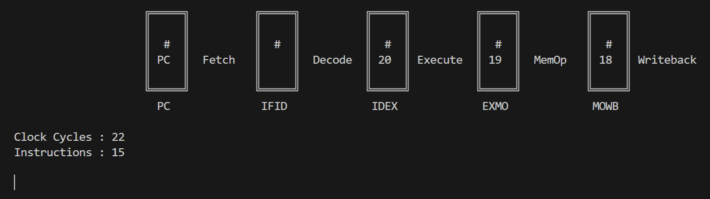
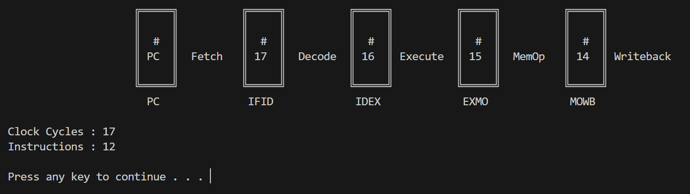

# RISC-V Assembler and Pipeline Simulator

An application that first converts a RISC-V assembly file into its corresponding object file (binary machine code) and then simulates the execution of the RISC-V pipeline using the object file.

## Supported Instructions

**R-Type :**

| Instruction       | Name                          | Syntax            |
|:------------------|:------------------------------|:------------------|
| add               | ADD                           | add rd, rs1, rs2  |
| sub               | SUB                           | sub rd, rs1, rs2  |
| xor               | XOR                           | xor rd, rs1, rs2  |
| or                | OR                            | or  rd, rs1, rs2  |
| and               | AND                           | and rd, rs1, rs2  |
| sll               | Shift Left Logical            | sll rd, rs1, rs2  |
| srl               | Shift Right Logical           | srl rd, rs1, rs2  |

**I-Type :**

| Instruction       | Name                          | Syntax            |
|:------------------|:------------------------------|:------------------|
| addi              | ADD Immediate                 | addi rd, rs1, imm |
| xori              | XOR Immediate                 | xori rd, rs1, imm |
| ori               | OR Immediate                  | ori  rd, rs1, imm |
| andi              | AND Immediate                 | andi rd, rs1, imm |
| slli              | Shift Left Logical Immediate  | slli rd, rs1, imm |
| srli              | Shift Right Logical Immediate | srli rd, rs1, imm |
| lw                | Load Word                     | lw rd, imm(rs1)   |
| jalr              | Jump And Link Register        | jalr rd, imm(rs1) |

**S-Type :**

| Instruction       | Name                          | Syntax            |
|:------------------|:------------------------------|:------------------|
| sw                | Store Word                    | sw rs2, imm(rs1)  |

**B-Type :**

| Instruction       | Name                          | Syntax            |
|:------------------|:------------------------------|:------------------|
| beq               | Branch Equal                  | beq rs1, rs2, imm |
| bne               | Branch Not Equal              | bne rs1, rs2, imm |
| blt               | Branch Less Than              | blt rs1, rs2, imm |
| bge               | Branch Greater Than Or Equal  | bge rs1, rs2, imm |

**J-Type :**

| Instruction       | Name                          | Syntax            |
|:------------------|:------------------------------|:------------------|
| jal               | Jump And Link                 | jal rd, imm       |

## Additional Support for Assembly Code

- For registers, both numeric names and ABI (Application Binary Interface) names are valid 

```bash
xor a0, zero, x3
addi sp, x25, 12
```

- Comments starting with '#'

```bash
# this is a comment
addi x1, zero, 7        # x1 := 7
```

- Negative immediate values

```bash
addi x1, zero, -4       # x1 := -4
```

- Hexadecimal immediate values

```bash
addi x1, zero, 0x1a     # x1 := 26
```

- String labels

```bash
for_loop :
    # instructions
```

## Program Execution and Guidelines

1. A Windows system is required with the GCC compiler installed.

2. Preferably use the console or terminal in full screen (or as big as possible).

3. Clone the repository.

4. Use the following command to compile the code :

   ```bash
   g++ main.cpp -o main.exe
   ```

5. Write your assembly code in the file `Input\assembly_file.s`. A sample assembly code has been provided.

6. Here are the commands to run the program -

    To run the code without displaying the simulation :

    ```bash
    ./main.exe
    ```

    To run the code with a display of simulation in automatic mode (automatically runs each clock cycle with a delay, delay must be an integer expressed in milliseconds) :

    ```bash
    ./main.exe display automatic 1000
    ```

    

    To run the code with a display of simulation in manual mode (will freeze after each clock cycle, press any key to continue) :

    ```bash
    ./main.exe display manual
    ```

    


7. Navigate to the `Output` folder to see the results.